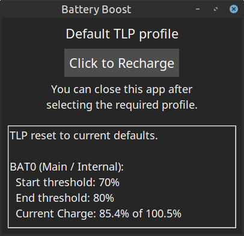

# Battery Boost

[](https://github.com/SteveDaulton/tlp-battery-boost/blob/main/LICENSE)
[](https://www.python.org/)

<p align="center">
  
</p>
_A lightweight Tkinter GUI to toggle TLP between normal battery optimization mode and temporary full-charge mode ( tlp fullcharge )._

## Overview

Battery Boost provides an easy-to-use interface for switching between normal and full-charge battery profiles using [TLP](https://linrunner.de/tlp/). It's designed for users who want to extend their battery lifespan by maintaining optimal charge levels during normal use, while having quick access to full charging when needed.

## Features

- Toggle Between Profiles: Switch between default TLP settings and full-charge mode
- Automatic Authentication: Enter your password once - the app maintains sudo privileges while running
- Battery Status Display: View current charge levels and threshold settings
- Theme Support: Choose between light and dark themes
- Adjustable Font Sizes: Scale the interface to your preference
- Terminal Integration: When run from terminal, displays status information for debugging

## Requirements

- Linux with TLP installed and configured
- Python 3.9+
- sudo privileges for TLP commands

## Installation

- Ensure TLP is installed on your system:

    ```
    sudo apt install tlp tlp-rdw  # For Debian/Ubuntu
    # or
    sudo dnf install tlp tlp-rdw  # For Fedora
    ```

- Clone this repository or download the script:

    ```
    git clone https://github.com/SteveDaulton/tlp-battery-boost.git
    cd tlp-battery-boost
    ```

- Make the script executable (optional):
    ```
    chmod +x battery_boost.py
    ```

## Usage

To launch the graphical interface:

    ./battery_boost.py
    # or
    python3 battery_boost.py


The app will:

- Prompt for your sudo password
- Initialize TLP to default settings
- Show the current battery status
- Provide a button to toggle between default and full-charge modes

## Command Line Options

    ./battery_boost.py --help
        -f, --font-size [1-5]: Set font size (1=smallest, 5=largest, default=3)
        -t, --theme [light|dark]: Choose color theme (default: light)
        -v, --version: Show version information


### Examples

**Large font with dark theme**

    ./battery_boost.py -f 5 -t dark

 
**Small font for compact displays**

    ./battery_boost.py --font-size 1


## How It Works

- Default Mode: Uses TLP's standard battery preservation settings (typically 80% charge limit)
- Full Charge Mode: Temporarily disables charge limits to charge the battery to 100%
- Authentication: Caches sudo credentials for 10 minutes to avoid repeated password prompts
- Status Monitoring: Uses `tlp-stat -b` to display current battery thresholds and charge levels

> For more information about TLP, see [https://linrunner.de/tlp/](https://linrunner.de/tlp/).


## Security Notes

- Your password is only used for initial sudo authentication and is immediately cleared from memory
- Your password is never written to disk.
- The sudo session is cleared and privileges are revoked on exit.
- No network connections are made - everything runs locally

## Troubleshooting

**TLP not found error:**

- Ensure TLP is installed and in your PATH
- Verify TLP is properly configured for your system

**Authentication issues:**

- Make sure you have sudo privileges
- Check that your password is correct

**Battery status not showing:**

- Verify your system's battery is detected by TLP
- Check that sudo tlp-stat -b works from the command line

## Contributing

Contributions are welcome! Please feel free to submit pull requests or open issues for bugs and feature requests.

## License

Licensed under the [GNU General Public License v3.0](https://github.com/SteveDaulton/tlp-battery-boost/blob/main/LICENSE).

**Note:** This application requires TLP to be properly configured for your specific hardware.
Some battery conservation features may not be available on all systems.
