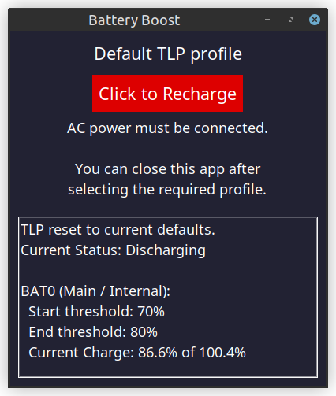

# TLP Battery Boost
Version {{ app_version }}

---

**TLP Battery Boost** is a lightweight Tkinter-based GUI for Linux laptops that optimise
battery longevity with [TLP](https://linrunner.de/tlp/index.html).
It is particularly useful for users who typically preserve battery health via configured
charging thresholds but occasionally require a full charge.

TLP Battery Boost provides a simple interface for switching between:

- **Balanced Charging:** TLP threshold-controlled charging behaviour.
- **Full-Charge Boost:** Temporary override to charge thresholds.

---

## How it works:

Battery Boost reads your TLP battery thresholds and charging state using `tlp-stat`.

Clicking the button applies a temporary override to the TLP controlled charging thresholds.
This allows the battery to charge to 100%.

By default, TLP restores the configured thresholds on the next reboot, or when Battery Boost
re-applies them by pressing the button again.

Optionally, if the configuration option `RESTORE_THRESHOLDS_ON_BAT` is enabled, thresholds
are restored when AC power is disconnected.

For further details, refer to the [TLP documentation](https://linrunner.de/tlp/faq/battery.html).

---

## Features

- Simple one-click toggle between configured battery-care thresholds and a full-charge override.
- Displays the current thresholds, battery level, and charging status.
- Provides **light** and **dark** desktop themes.
- No background services, daemons, or timers.
- Lightweight - built with Python and Tkinter.

### Security

Authentication is handled entirely by `sudo`; passwords are not stored, logged, or transmitted.
Elevated privileges are cleared on exit.

---

## Getting Started

- **[Installation instructions](installation.md)**  
- **[Usage guide](usage.md)**  
- **[Troubleshooting](troubleshooting.md)**  
- **[API Reference](appendix-api.md)** (for developers)

---

## Requirements

- Linux system with **TLP installed and configured**
- Python **3.10+**
- Python3-tk (Tkinter)

---

## About the Project

TLP Battery Boost is open-source (GPL-3.0) and hosted on
[GitHub](https://github.com/SteveDaulton/tlp-battery-boost)

Contributions, bug reports, and feature suggestions are welcome.
